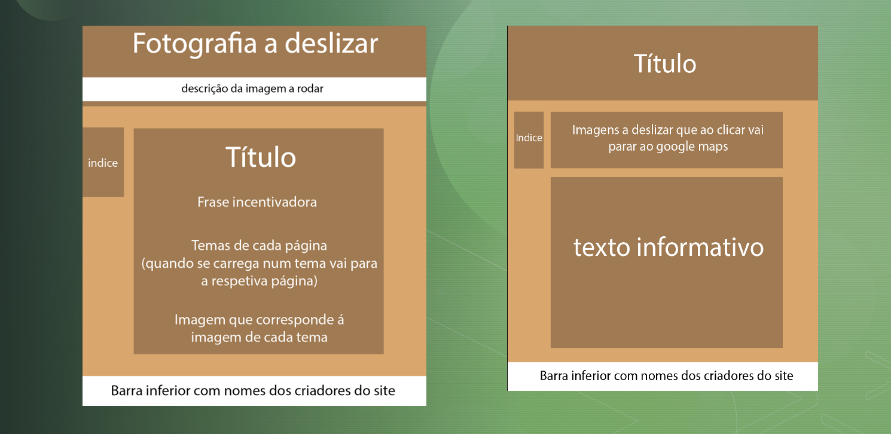
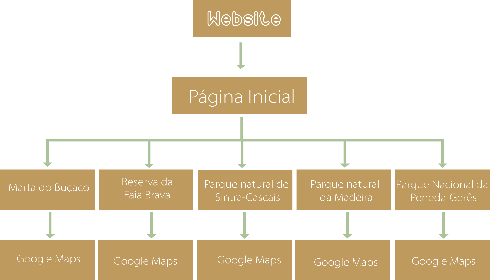
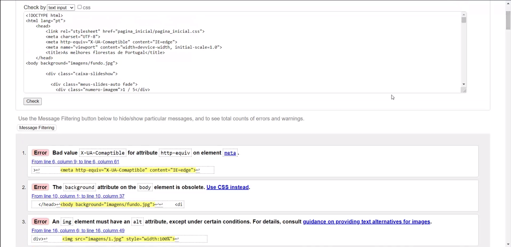

# Relatório

## *Trabalho realizado por* 
### *- Daniel Gomes*
### *-Rafael Maia* 
### *-Tiago Monteiro*
___

### Link do Github: 

--- 
## **Apresentação do projeto** 
Para o trabalho final de Tecnologias Web foi-nos proposto o desenvolvimento de uma página web que se conte tudo aquilo que aprendemos até ao momento e que respeitasse os parâmetros estabelecidos pelo docente. A temática escolhida para o mesmo foi “Florestas” e com isso em mente o grupo pensou no que poderíamos elaborar, e apos isso concluímos que gostaríamos de fazer uma página onde falássemos sobre as florestas Portuguesas e toda a informação interessante sobre a mesma. 
Na página inicial podemos encontrar no cimo fotografias que vão-se alternando em slider automático, conseguimos fazer isto através de Javacript. Depois temos como título “As melhores florestas de Portugal” já que esse é o nosso tema. Nesta página principal observamos informação sobre 5 florestas de Portugal (Mata do buçaco , Reserva da Faia Brava, Parque Natural de Sintra-Cascais e Parque natural da Madeira, Parque nacional da peneda-gerês) com as respetivas fotografias. No fundo desta página ao clicar onde diz “Curiosidades”, irá levar o visitante até outra página onde encontra uma tabela sobre outros países e a respetiva área florestal.  Temos outra opção que diz “Deixe que a sua opinião”, que clicando nos leva a outra página onde existirá um formulário para o visitante dar a sua opinião. Vemos também um índice em forma de lista, do lado esquerdo que é uma forma de organização do nosso site, que irá estar presente em todas as páginas.  Em baixo colocamos um footer em verde, de forma a combinar com o resto do layout,  que desliza ,onde tem os nomes das pessoas que realizaram este trabalho, este footer irá estar presente em todas as páginas do website. Nesta página inserimos como fundo uma imagem com padrão que achamos adequado à temática. Ao clicar nas fotografias das florestas presentes nesta página vai nos direcionar a outra página respetivamente, onde terá mais informação sobre cada floresta. Nessas páginas no cimo, existe mais fotografias sobre cada a floresta em modo slider, mas neste caso é necessário clicar na seta para a fotografia se alterar. Ao clicar nas imagens, estas vão nos direcionar para o Google map, através de uma hiperligação, o que acaba por ser bastante prático para os nossos visitantes. Nestas páginas secundárias, inserimos como cor de fundo um degradê a verde para ser diferente da página inicial. Caso o visitante queira voltar a página inicial pode clicar no índice onde diz “página inicial” e será logo direcionado para lá, tornando assim o site mais prático. 

---

## **2. Interface com o utilizador** 
---

### _Sketch_ :

### _Sitemap_: 

---

## **3.Produto**

### _1. Descrição_:
Website sobre as melhores florestas a visitar em Portugal. 

### _2. Regras de utilização_:
É de fácil utilização e não o utilizador criar uma conta para poder visualizar o nosso website.

### _3. Ajuda à navegação_:
O website é simples e prático de forma a qualquer pessoa poder utilizá-lo. Existem várias hiperligações, como o facto de clicar numa das fotografias de uma floresta e direcionar-nos logo para outra página com mais informação sobre a mesma. Ao clicar nestas fotografias das páginas secundários também há uma ligação direta ao Google maps, fazendo com que o utilizador poupe tempo de pesquisa.  

### _4. Validação do formulário_:
Usamos um formulário simples onde as pessoas podem dar a sua opinião sobre o website. Para responder ao formulário basta colocar o seu nome, e-mail e a respetivo comentário.

### _5. Validação do HTML E CSS_:

- HTML

Foram detetados alguns erros mas não conseguimos soluciona-los todos.

- CSS

### _6. Detalhes de implementação_:
Pensamos que cumprimos os objetivos pedidos pelo professor. A utilização de javacript não era obrigatória mas nós utilizamos